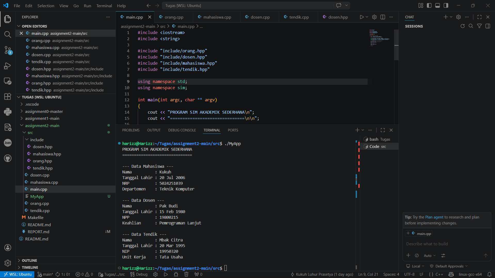

# Buat Laporan Disini

## Kamis, 2 April 2026
- Membaca ulang apa yang dimaksud engan Inheritance dan Namespace
- Memahami maksud tugas yang diberikan dengan membaca file `README.md`
- Membuat folder baru bernama `include` karena di main.cpp sudah ada template yang mengharuskan memakai nama `include/...`
- Membuat file `.hpp` sesuai dengan yang ada di template `main.cpp`
- Membuat file `.cpp` sebagai isi dari seluruh program dari file `.hpp` nya

## Jum'at, 3 April 2026
    - Menyelesaikan kode eksekusi perintah tugas di main.cpp
    - Mencoba mengcompile untuk mencari error
    - Debugging
    - Finishing

## 2. Struktur Kode dan Penjelasan Konsep
Dalam mengerjakan tugas ini, saya menggunakan beberapa konsep utama OOP:

### A. Pewarisan (Inheritance)
Saya membuat satu *base class* (induk) bernama `Orang` yang menyimpan atribut umum. Class lain kemudian mewarisi atribut ini:
* **Class Orang**: Menyimpan `nama` dan `tanggal_lahir`.
* **Class Mahasiswa**: Mewarisi `Orang` + atribut `NRP` dan `Departemen`.
* **Class Dosen**: Mewarisi `Orang` + atribut `NPP` dan `Keahlian`.
* **Class Tendik**: Mewarisi `Orang` + atribut `NIP` dan `Unit Kerja`.

### B. Penggunaan Namespace
Untuk merapikan kode dan menghindari bentrok nama fungsi, saya membungkus seluruh class ke dalam custom namespace:
```cpp
namespace sim {
    // Seluruh class didefinisikan di sini
}
```
### C. Implementasi Program
Berikut adalah contoh sintaks yang saya gunakan pada file `mahasiswa.cpp`:
```cpp
// Memanggil constructor class Orang, lalu mengisi sisa variabelnya
Mahasiswa::Mahasiswa(string input_nama, string input_tgl, string input_nrp, string input_dept) 
    : Orang(input_nama, input_tgl) { // Mengirim nama dan tgl ke class Orang
    
    nrp = input_nrp;
    departemen = input_dept;
}

void Mahasiswa::tampilkanData() {
    cout << "--- Data Mahasiswa ---" << endl;
    Orang::tampilkanData(); // Menampilkan nama dan tgl lahir dari induk
    cout << "NRP           : " << nrp << endl;
    cout << "Departemen    : " << departemen << endl;
}
```
## 3. Output Program
```cpp
PROGRAM SIM AKADEMIK SEDERHANA
==============================

--- Data Mahasiswa ---
Nama          : Kukuh
Tanggal Lahir : 20 Jul 2006
NRP           : 5024251039
Departemen    : Teknik Komputer

--- Data Dosen ---
Nama          : Pak Budi
Tanggal Lahir : 15 Feb 1980
NPP           : 19800215
Keahlian      : Pemrograman Lanjut

--- Data Tendik ---
Nama          : Mbak Citra
Tanggal Lahir : 20 Mar 1995
NIP           : 19950320
Unit Kerja    : Tata Usaha  
```
### Dokumentasi Output

