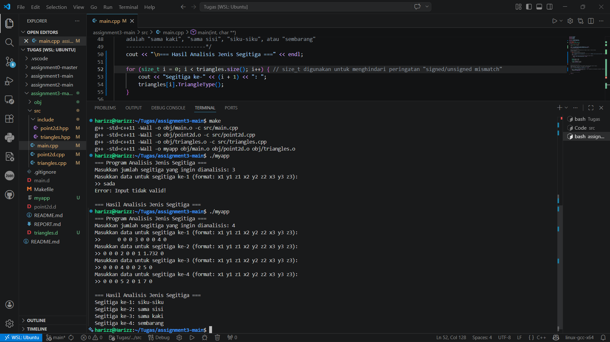
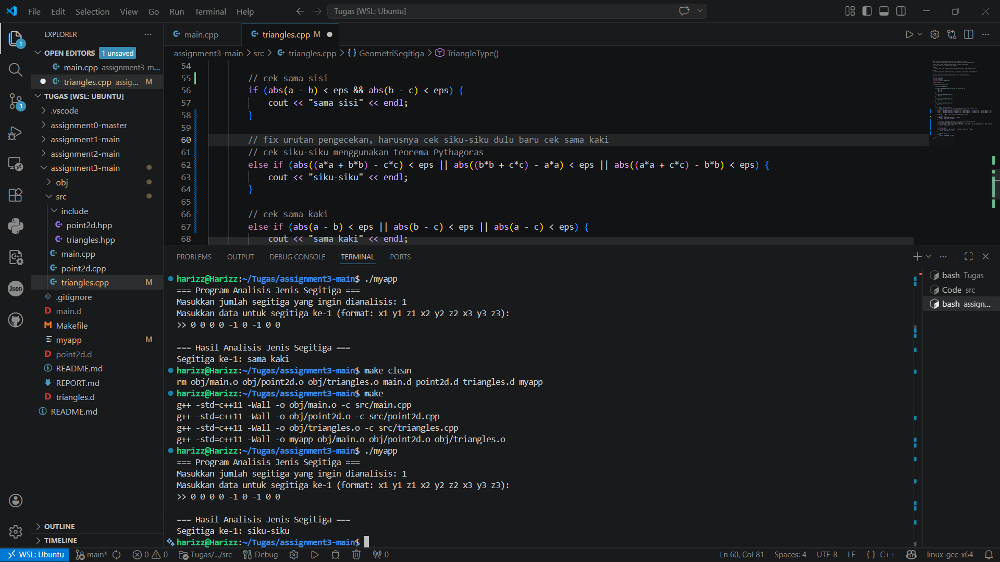

# Laporan Tugas 4

## Rabu, 15 April 2026
- Memahami maksud dari tugas yang diberikan dengan membaca file `README.md`
- Menyusun kode pada setiap file `.hpp` dan `.cpp` sesuai petunjuk template
- Berulang kali mengcompile dan menemukan cukup banyak error
- Debugging
- Finishing

## 1. Penjelasan Sintak Sintak  
- `namespace GeometriSegitiga`  
  Mencegah terjadinya bentrok nama kelas (_naming collision_) jika nanti kodingan ini digabung dengan library lain yang juga punya kelas bernama `Triangle`.
- `std::vector<Triangle>`  
  Supaya program bisa menampung berapa pun jumlah segitiga (_n_) yang diinput user tanpa aku harus tahu ukurannya dari awal. Aku tinggal pakai `.push_back()` untuk memasukkan datanya.
- `#ifndef` dan `#define` (Header Guards)  
  Supaya tidak terjadi _redefinition error_. Jadi jika satu file di-_include_ berkali-kali di bagian lain, program tetap aman dan tidak bingung mendefinisikan ulang kelas yang sama.
- `size_t`  
  Saya memakai ini di perulangan `for` supaya tipe datanya cocok dengan kembalian dari fungsi `.size()`. Sebelumnya error `unsigned` karena aku memakai `int`.
- `eps = 0.001`
  Sebagai ambang batas toleransi. Ini membuat deteksi siku-siku dan sama kaki menjadi jauh lebih akurat karena angka `float` sering punya selisih sangat kecil di belakang koma.

## 2. Error/Warning dan Solusi
- Error: `Fatal error: can't create obj/main.o`  
  Saya membuat folder `obj` secara manual di VS Code. Setelah folder tersedia, perintah `make` baru bisa berjalan dengan lancar.
- Warning: `Comparison of integer expressions of different signedness`
  Aku mengubah tipe data variabel perulangan dari `int` menjadi `size_t`. Ini menghilangkan pesan _warning_ dan membuat kode lebih aman dari masalah _buffer overflow_.
- Kesalahan Output: Salah Deteksi pada Segitiga Siku-Siku atau Sama Kaki  
  Saya mengubah urutan `if-else` dengan menaruh logika Pythagoras (Siku-Siku) di atas logika Sama Kaki, sehingga hasil yang keluar adalah yang paling spesifik.
- Masalah Presisi: Gagal Deteksi Siku-Siku karena Angka Desimal  
  Saya menggunakan variabel `eps` (epsilon) sebagai nilai toleransi. Jadi, perbandingannya bukan lagi "sama dengan", melainkan "apakah selisihnya lebih kecil dari 0.001".

## Input/Output
```cpp
=== Program Analisis Jenis Segitiga ===
Masukkan jumlah segitiga yang ingin dianalisis: 4
Masukkan data untuk segitiga ke-1 (format: x1 y1 z1 x2 y2 z2 x3 y3 z3): 
>>      0 0 0 3 0 0 0 4 0
Masukkan data untuk segitiga ke-2 (format: x1 y1 z1 x2 y2 z2 x3 y3 z3): 
>> 0 0 0 2 0 0 1 1.732 0
Masukkan data untuk segitiga ke-3 (format: x1 y1 z1 x2 y2 z2 x3 y3 z3): 
>> 0 0 0 4 0 0 2 5 0
Masukkan data untuk segitiga ke-4 (format: x1 y1 z1 x2 y2 z2 x3 y3 z3): 
>> 0 0 0 5 2 0 1 7 0

=== Hasil Analisis Jenis Segitiga ===
Segitiga ke-1: siku-siku
Segitiga ke-2: sama sisi
Segitiga ke-3: sama kaki
Segitiga ke-4: sembarang
```
### Dokumentasi Program
Input/Output  
  
Fix Error  



